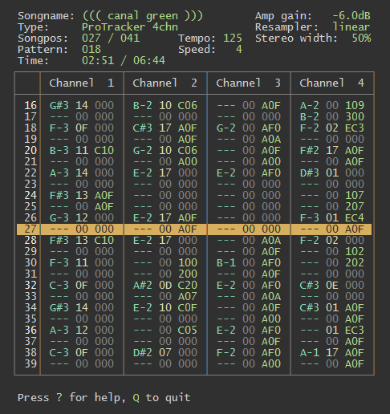

# nim-mod

Some people ride ridiculously expensive Harley-Davidsons, collect vintage
guitars or marry 20 years younger platinum blondes when midlife crisis strikes.

I write modplayers.

### Features

* Pretty accurate **Amiga ProTracker 2.3D** compatible playback
* Supports **4-channel SoundTracker** (15 samples), **4-channel ProTracker** (31
  samples) and other **2-99 channel MOD formats** (FastTracker II, OctaMED,
  StarTrekker etc.)
* Cross-platform (Windows, Linux & OS X)
* Kickass console UI
* WAV writer (16/24-bit integer, 32-bit float)
* Change play position during playback with speed/tempo & pattern jump chasing
* Song length calculation with loop detection
* Adjustable stereo width & gain factor
* Vim-inspired keyboard shortcuts (**SUPR IMPRTANT!!!!!11**)
* Uses FMOD for audio playback

